## What is STARS?
The University of California, San Diego Summer Training Academy for Research Success (STARS) program is an eight-week summer research academy for community college students, undergraduate students, recent college graduates, and masters students. Opened to all disciplines, STARS offers student participants a rigorous research opportunity with esteemed UC San Diego faculty, informative transfer and graduate school preparation workshops, and educational, cultural, and social activities in sunny San Diego.

## What is Great About the Program?

As an alumni of the program I know how transformative it can be. I credit the STARS program for helping me get into graduate school. The GRE training and Fellowships application training I received were a big help while I was preparing to finish my last year of Graduate School. Most importantly the friends and mentors I met through the program have been an excellent support network that has enabled me to navigate the academic world. Being a Graduate Advocate allowed me to pass on some of the knowledge I gained since my participation to the next class of engineering graduate students of color.

<ul class="clearing-thumbs small-block-grid-4" data-clearing>
  <li><a href="../../images/stars_group_certificates.jpeg">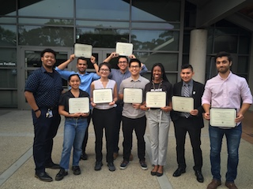</a></li>

  <li><a href="../../images/stars-group-photo-fun-1.jpg">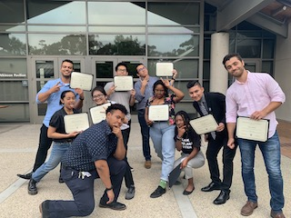</a></li>

  <li><a href="../../images/stars-group-photo-fun-2.jpg">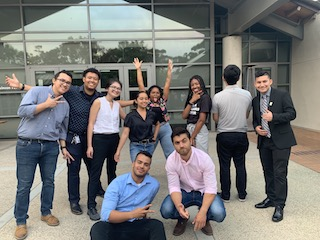</a></li>

  <li><a href="../../images/stars-group-photo-fun-3.jpg">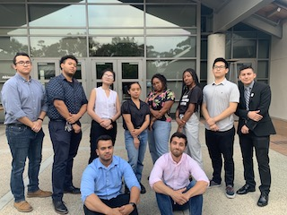</a></li>

  <li><a href="../../images/stars_oscar_presentation.jpg">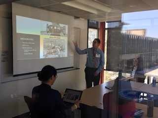</a></li>

  <li><a href="../../images/stars_sarah_presentation.jpg">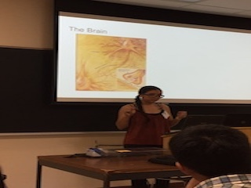</a></li>

  <li><a href="../../images/stars_isabel_presentation.jpg">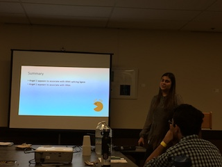</a></li>

  <li><a href="../../images/stars_xavier_presentation.jpg">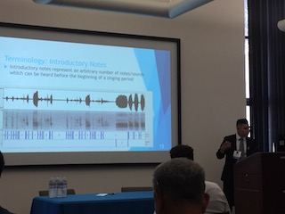</a></li>

  <li><a href="../../images/stars_cameron_presentation.jpg">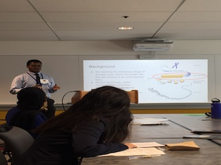</a></li>

  <li><a href="../../images/stars_jairo_presentation.jpg">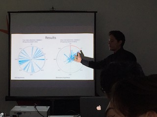</a></li>

  <li><a href="../../images/stars_derek_presentation.jpg">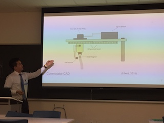</a></li>

  <li><a href="../../images/stars_summer_conference.jpg">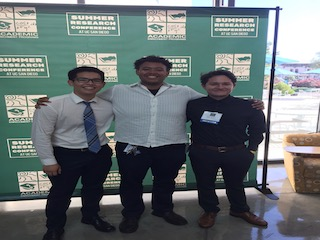</a></li>
</ul>

[Learn More About STARS](https://grad.ucsd.edu/diversity/programs/stars/index.html)
